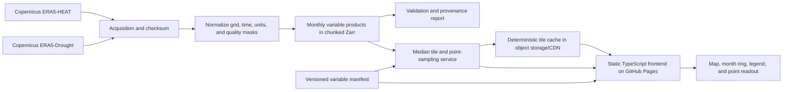

# Global Human Thermal Comfort × Drought Map

Comprehensive implementation plan  
Status: proposed target state  
Prepared: 2026-07-22

## 1. Outcome

Replace the current Mediterranean crop-suitability prototype with a global, map-first application that shows the relationship between outdoor human thermal conditions and drought.

The initial map has two default axes:

1. **Thermal axis:** Universal Thermal Climate Index (UTCI).
2. **Drought axis:** 3-month Standardised Precipitation-Evapotranspiration Index (SPEI-3).

The user chooses an analysis year and a non-empty set of calendar months. A circular month selector must support one month, any arbitrary combination of months, and all twelve months. Every map cell shows the median of the selected monthly observations for each axis. Those two values are classified into a 3 × 3 bivariate color matrix.

The product must be global in navigation and presentation. The initial data coverage is global land from 90°N to 60°S because ERA5-HEAT does not cover Antarctica. Antarctica remains visible and is explicitly marked as no data.

The implementation is complete when:

- the map opens with the latest complete data year and all months selected;
- changing any month selection updates the map, legend, period label, URL, and point readout;
- all 4,095 non-empty month combinations are valid;
- UTCI and SPEI-3 values, classifications, sources, dates, units, and limitations are clear;
- the same frontend can add a new variable through configuration and data publication rather than bespoke UI code;
- one selected variable produces a univariate map and two produce a bivariate map;
- source, pipeline, API, frontend, tests, and deployment instructions live in this repository;
- raw and analysis-ready climate archives are versioned outside Git;
- the legacy application is removed only after the replacement passes the release gates in section 15.

## 2. Decisions at a glance

| Concern | Decision |
| --- | --- |
| Thermal-comfort measure | UTCI, specifically the monthly median of daily maximum UTCI |
| Drought measure | SPEI-3 |
| Initial data provider | ECMWF/Copernicus ERA5-HEAT and ERA5-Drought |
| Default time | Latest complete calendar year |
| User aggregation | Median across the selected monthly layers; months have equal weight |
| Bivariate scheme | 3 × 3 fixed, interpretable classes |
| Initial grid | Common 0.25° latitude/longitude source grid, served as tiles |
| Map engine | MapLibre GL JS with raster tiles and a lightweight vector basemap |
| Frontend | TypeScript modules built with Vite into `docs/` |
| Data processing | Python, xarray, Dask, rioxarray/rasterio, Zarr, and COG tooling |
| Dynamic combinations | Tile/aggregation service with deterministic object-storage caching |
| Static hosting | GitHub Pages for the frontend; separate service and object storage for data |
| Extension model | Manifest-driven variable registry and two generic selection slots |

These are implementation defaults, not hidden assumptions. The application must expose the analysis year, selected months, statistic, source version, and data timestamp.

## 3. Current-state audit

The repository currently contains a generated public prototype rather than a maintainable application:

| Current element | Finding | Required change |
| --- | --- | --- |
| Geography | Bounds are limited to the Mediterranean basin | Replace with global navigation and global land data |
| Purpose | Crop and “Human Comfort” suitability scores | Remove crop concepts and publish physical variables with real units |
| Measures | TerraClimate-derived 0–100 temperature, humidity, precipitation, and total scores | Replace with documented UTCI and SPEI-3 values |
| Time | Annual climatology or single-year annual scores, 1991–2020 | Add monthly source layers, analysis year, and arbitrary month-set aggregation |
| Symbology | One univariate sequential or categorical scale | Add 3 × 3 bivariate classification and legend |
| Month interaction | None | Add accessible circular 12-month multi-selector |
| Frontend | One 568-line global script with hard-coded controls and layers | Split into typed state, registry, controls, map, legend, data, and analytics modules |
| Raster delivery | Whole-area TIFFs and WebP overlays committed to Git | Move canonical arrays and tiles to versioned object storage |
| Rendering | Leaflet image overlay or client GeoTIFF parsing | Use tiled global delivery and MapLibre raster rendering |
| Data contract | Crop-oriented manifests with `annual_layers` | Introduce a variable-neutral, versioned manifest schema |
| Pipeline | README points to a parent project that is not present here | Add a first-class, reproducible pipeline to this repository |
| Verification | No automated tests | Add scientific, data-contract, API, UI, visual, accessibility, and performance tests |
| Repository weight | Hundreds of generated rasters are committed | Remove legacy rasters after cutover and prevent generated archives from returning |

The existing application is useful only as a behavioral reference for raster sampling, source display, responsive layout, and GitHub Pages publishing.

## 4. Scientific specification

### 4.1 Human thermal comfort: UTCI

Use the **Universal Thermal Climate Index** from ERA5-HEAT. UTCI is a physiologically based equivalent temperature that combines air temperature, humidity, wind, and mean radiant temperature. Copernicus describes ERA5-HEAT as a state-of-the-art bioclimatology data record. It is a materially better choice than air temperature, heat index, humidex, or wet-bulb temperature for general outdoor thermal conditions because it represents both heat and cold stress and includes radiation and wind.

Initial published variable:

- ID: `utci_daymax_median`
- UI label: `Typical daily peak UTCI`
- Unit: `°C`
- Source: ERA5-HEAT daily maximum UTCI
- Monthly preprocessing: median of the daily maximum UTCI values in each cell and calendar month
- Rationale for daily maximum: it represents a typical daily peak outdoor exposure and avoids an all-hour median being dominated by nighttime conditions
- Limitation: a 0.25° reanalysis cell cannot resolve shade, buildings, urban heat islands, terrain-scale winds, personal activity, clothing, age, health, or access to cooling

The exact UI term must be “outdoor thermal conditions” or “thermal stress,” not a promise of individual comfort or health outcome.

### 4.2 Drought: SPEI-3

There is no universally best drought index for every drought type. Drought can be meteorological, agricultural, ecological, hydrological, or socioeconomic, and its relevant accumulation period changes by use case.

Use **SPEI-3** as the initial general-purpose choice because it:

- measures precipitation minus potential evapotranspiration;
- incorporates atmospheric water demand and therefore the influence of temperature;
- is comparable across different climates because it is standardized;
- captures roughly seasonal water-balance anomalies;
- is more responsive to agricultural and ecological stress than 12-month SPEI while being less noisy than 1-month SPEI;
- is published on the same 0.25° ERA5 grid as the chosen UTCI source.

Initial published variable:

- ID: `spei_3`
- UI label: `3-month drought (SPEI-3)`
- Unit: `standard deviations`
- Source: ERA5-Drought deterministic reanalysis
- Monthly preprocessing: use the provider’s monthly SPEI-3 field
- Interpretation: negative is drier than the 1991–2020 reference climate; positive is wetter
- Quality rule: mask or flag cells that fail the provider’s SPEI normality-quality field
- Limitation: SPEI-3 characterizes meteorological water-balance drought, not water demand, groundwater, reservoir storage, streamflow, soil moisture, crop response, governance, or household water access

Potential later variables should include SPEI-1, SPEI-6, SPEI-12, soil-moisture percentile, and climatic water deficit, each as a separate registry entry. Do not silently let one “drought timescale” control change the meaning of `spei_3`.

### 4.3 Temporal semantics

The initial interface includes a visible analysis-year control in addition to the required month ring.

For grid cell \(p\), analysis year \(y\), and selected non-empty month set \(M\):

```text
thermal_value(p, y, M) =
  median(monthly_median_daily_max_UTCI(p, y, m) for m in M)

drought_value(p, y, M) =
  median(SPEI3(p, y, m) for m in M)
```

Rules:

- Months are the unit of selection and receive equal weight.
- A one-month selection returns that month’s value.
- “All year” returns the median of the 12 monthly values, not an annual mean.
- For an even number of valid months, use the arithmetic mean of the two center values.
- Ignore no-data observations only when the variable’s manifest allows it.
- Require at least `ceil(selected_month_count × 0.75)` valid months, with a minimum of one; otherwise return no data.
- SPEI-3 for January already represents the provider’s three-month accumulation ending in January. The month selector does not recompute the SPEI accumulation window.
- Dates use calendar months in UTC. No hemisphere-specific season names are inferred.
- The latest complete year is the default. A partial current year can be offered later only if unavailable months are visibly disabled and “all year” is not presented as complete.

This definition must be included in the methodology panel and API metadata.

### 4.4 Why climatological median is not the initial drought view

SPEI is standardized against a reference climate and is constructed around a mean near zero. Taking a 1991–2020 median of SPEI for every grid cell would therefore produce a largely near-normal map and would not represent chronic dryness or drought risk.

If a later “1991–2020 climatology” mode is added:

- UTCI may use climatological monthly medians;
- the drought side must change to a clearly named metric such as `frequency of SPEI-3 ≤ -1` or `median SPEI-3 during drought months`;
- the UI and URL must identify this as a different statistic;
- it must not claim that median reference-period SPEI is drought risk.

### 4.5 Initial classification

Use a 3 × 3 matrix. Three classes per axis are the maximum recommended for the default map because nine combined colors remain learnable and can be explained in a compact legend.

Thermal classes retain the direction of thermal conditions:

| Class | UTCI | Label |
| --- | ---: | --- |
| 0 | `< 9°C` | Cold stress |
| 1 | `9–26°C` | No thermal stress |
| 2 | `> 26°C` | Heat stress |

Drought classes focus on drought severity rather than treating wetness as “high drought”:

| Class | SPEI-3 | Label |
| --- | ---: | --- |
| 0 | `> -1.0` | No drought |
| 1 | `-1.5 < value ≤ -1.0` | Moderate drought |
| 2 | `≤ -1.5` | Severe or extreme drought |

The popup always shows the exact values and the provider’s finer UTCI/SPEI categories. The three-class map is a legibility choice, not a replacement for the underlying continuous data.

Before release, a climate scientist must approve the variable definitions, aggregation order, missing-data rule, thresholds, labels, and limitations. A user study must confirm that people can correctly interpret at least seven of nine legend-cell scenarios without coaching.

## 5. Product and interaction specification

### 5.1 Layout

The map dominates the viewport. Desktop uses a compact side panel; narrow screens use a collapsible control sheet that leaves a useful map area visible.

The initial information hierarchy is:

1. Map title and current period.
2. Axis X and Axis Y variable selectors.
3. Analysis year.
4. Circular month selector.
5. Bivariate legend.
6. Methodology, sources, data version, and limitations.

Do not carry forward crop selection, score-layer selection, annual-climatology mode, or categorical/continuous color toggles.

### 5.2 Variable selection

Use two generic slots:

- `Axis X`
- `Axis Y`

The initial values are SPEI-3 on X and UTCI on Y. The user may:

- choose one variable and see its univariate scale;
- choose two different compatible variables and see a bivariate map;
- swap X and Y without changing the data;
- clear the second slot;
- never select more than two variables.

Compatibility is data-driven. A candidate is disabled, with a reason, when it has no common year, month, grid, statistic, or coverage with the other selected variable.

### 5.3 Circular month selector

The month selector is a circular control with twelve equal wedges in January-to-December clockwise order:

- every wedge has a visible short month label;
- click, tap, Enter, or Space toggles one month;
- selection supports disjoint sets such as January + April + September;
- dragging may paint a selection only as a progressive enhancement;
- the center shows `1 month`, `N months`, or `All year`;
- an adjacent text summary gives an unambiguous value such as `Jan, Mar–May, Sep`;
- the control never permits an empty set; attempting to remove the final month leaves it selected and announces the rule;
- “All year” is a direct center action when fewer than twelve months are selected;
- selecting all twelve wedges and using “All year” produce the same state;
- DOM order is January through December, independent of visual positioning;
- each wedge is a native button with `aria-pressed`, an accessible full month name, and a visible focus state;
- the selector has a non-circular checkbox fallback if CSS transforms or scripting fail.

Represent the selection internally as a 12-bit integer:

```text
January  = 1 << 0
February = 1 << 1
...
December = 1 << 11
All year = 4095 = 0xfff
```

The canonical URL uses the three-digit hexadecimal mask, for example `months=115`. Unit tests must enumerate all masks from 1 through 4095.

### 5.4 Bivariate map and legend

Follow the referenced Aqueduct example’s core idea: two independently meaningful axes meet in a matrix, and each map color corresponds to one cell.

Requirements:

- fixed 3 × 3 legend with the same orientation as the variable controls;
- X-axis label, direction, thresholds, and units are visible;
- Y-axis label, direction, thresholds, and units are visible;
- the selected legend cell is highlighted when the user points to a map cell;
- hovering or focusing a legend cell temporarily emphasizes matching map areas;
- no-data has a neutral crosshatch and is not part of the nine-color matrix;
- country boundaries and labels remain legible without competing with the data;
- exact meaning never depends on color alone: legend cells contain short paired labels, and the point readout includes both class names;
- palette is tested with common color-vision-deficiency simulations, grayscale, light and dark displays, and low-contrast basemaps;
- class colors are fixed across months and years so apparent change is data change, not rescaling;
- quantile breaks are not recalculated per selection.

The first palette should be designed and tested rather than copied blindly. It should use two perceptually distinct sequential directions whose mixtures preserve nine separable classes. Store palette and threshold versions in the manifest and cache key.

### 5.5 Point inspection

Click, tap, or keyboard selection opens a compact readout:

- latitude/longitude or named region when available;
- selected period and analysis year;
- median UTCI, unit, and thermal class;
- median SPEI-3, unit, and drought class;
- number of valid selected months for each variable;
- finer provider category where applicable;
- source dataset versions and last update;
- warning when the cell fails a source-quality flag;
- statement that the values represent a grid cell, not the exact point or a personal exposure forecast.

### 5.6 Shareable state

Keep state in a single typed store and serialize it to the URL:

```text
?x=spei_3&y=utci_daymax_median&year=2025&months=fff&lng=12.5&lat=41.9&zoom=3
```

Back/forward navigation, reload, copied links, and automated tests must restore the same map. Invalid values fall back safely and produce one non-blocking warning.

## 6. Target architecture



### 6.1 Repository layout

```text
config/
  app.yaml
  variables/
    utci_daymax_median.yaml
    spei_3.yaml
pipeline/
  pyproject.toml
  src/thermal_drought/
    acquire/
    normalize/
    aggregate/
    classify/
    publish/
    validate/
  scripts/
services/
  tile_api/
web/
  package.json
  src/
    app/
    controls/
    data/
    legend/
    map/
    state/
    styles/
  public/
tests/
  data/
  integration/
  e2e/
  visual/
docs/                 Generated frontend only
```

Generated arrays, tiles, caches, credentials, and local CDS downloads are ignored by Git.

### 6.2 Data layers

1. **Raw source cache:** immutable provider files plus request JSON, checksum, retrieval time, licence, and provider version.
2. **Normalized canonical store:** chunked Zarr on a common grid, with one logical array per variable and dimensions such as `time, latitude, longitude`.
3. **Published monthly store:** compact, read-optimized chunks by variable, year, month, and spatial tile.
4. **Composite cache:** immutable bivariate tiles keyed by all inputs that can change a rendered result.
5. **Public manifest:** small JSON contract describing variables, availability, thresholds, palettes, sources, and endpoints.

Use object versioning and lifecycle rules. Never overwrite a published version in place.

Local development and acquisition are governed by the versioned
`config/storage-policy.json` contract. Before a guarded write, the pipeline
must inventory the relevant managed directory and preflight both free-space
reserve and volume high-water limits. The initial local envelope is:

- 20 GiB of untouchable free space and an 80% maximum volume-use threshold;
- one full-year local backfill, estimated conservatively at a three-times
  processing peak;
- 3 GiB raw, 5 GiB canonical, 5 GiB published, 2 GiB composite-cache, and
  2 GiB tile quotas;
- 512 MiB maximum acquisition partitions plus bounded archive and normalization
  workspace;
- monthly serving products only. Daily maximum UTCI remains a source frequency,
  is reduced to monthly medians after validation, and is then archived outside
  local serving storage;
- no automatic deletion. Multi-year backfill requires reviewed object storage,
  versioning, lifecycle policy, and a fresh capacity estimate.

Annual byte figures are planning estimates, not claims about provider
compression or measured observations. A blocked preflight must produce a
machine-readable reason and leave the intended write unstarted.

### 6.3 Aggregation and tile service

A small stateless service performs arbitrary month aggregation:

```text
GET /v1/tiles/{datasetVersion}/{xVariable}/{yVariable}/{year}/{monthMask}/{z}/{x}/{y}.webp
GET /v1/sample?x=...&y=...&year=...&months=...&lng=...&lat=...
GET /v1/availability
GET /v1/health
```

Behavior:

- validate variable compatibility, year, month mask, zoom, and coordinates;
- read only the spatial chunks and 1–12 monthly slices needed for the requested tile;
- calculate the two medians and apply manifest classifications;
- return a transparent RGBA tile with strong immutable caching;
- use the identical aggregation library for tiles and point sampling;
- include dataset, statistic, classification, palette, software, and API versions in the cache key;
- publish ETags and long-lived cache headers for immutable versions;
- return a structured no-data or quality state, not a fabricated zero;
- rate-limit abusive traffic and cap zoom;
- never expose CDS credentials to the browser.

Pre-warm the cache for:

- twelve single months;
- four meteorological seasons;
- all twelve months;
- the default variable pair;
- the latest three complete years;
- zoom levels used by the initial global view.

The month-mask allowlist is exactly 17 masks: twelve single months, four
meteorological seasons, and all twelve months. Local warming cannot cross the
2 GiB cache or tile quota; expansion across years and zooms waits for measured
production sizing and object storage. Arbitrary combinations are computed on
first request and then cached on demand. The UI keeps the current map visible
with a clear updating state until the first new tiles arrive.

### 6.4 Frontend

Replace the global `docs/app.js` script with a TypeScript/Vite application:

- MapLibre GL JS provides global navigation, raster tile layers, world wrapping, and vector boundaries;
- a typed store owns variable selection, year, month mask, location, zoom, request status, and inspected cell;
- controls render from the manifest rather than from hard-coded variable names;
- one map-source module converts state into versioned tile URLs;
- the legend renders from the selected variables’ classification metadata and palette matrix;
- AbortController cancels stale availability and sample requests;
- rapid month changes are debounced only for network work, not for visible control feedback;
- errors preserve the last good map and offer a retry;
- the generated build is written to `docs/` and contains no canonical climate rasters.

The existing Leaflet prototype can remain at a temporary `/legacy/` path during development. Do not carry its EPSG:4326 map assumptions, crop-oriented state, or browser GeoTIFF cache into the new design.

## 7. Variable registry and extensibility

The frontend, aggregation service, and pipeline must share a versioned variable contract. A simplified public entry:

```json
{
  "schema_version": "1.0",
  "id": "spei_3",
  "label": "3-month drought (SPEI-3)",
  "description": "Standardized 3-month precipitation minus potential evapotranspiration anomaly.",
  "unit": "standard deviations",
  "role_hint": "x",
  "source": {
    "dataset": "ERA5-Drought",
    "provider": "ECMWF/Copernicus",
    "doi": "10.24381/9bea5e16",
    "version": "1.0",
    "reference_period": "1991-2020",
    "license": "CC-BY"
  },
  "coverage": {
    "bbox": [-180, -60, 180, 90],
    "resolution_degrees": 0.25,
    "calendar": "gregorian",
    "years": [1991, 2025],
    "months": [1, 12]
  },
  "aggregation": {
    "input_frequency": "monthly",
    "allowed": ["median"],
    "default": "median",
    "minimum_valid_fraction": 0.75
  },
  "classification": {
    "type": "fixed",
    "breaks": [-1.5, -1.0],
    "order": "descending_raw_value",
    "labels": ["Severe or extreme drought", "Moderate drought", "No drought"],
    "version": "1"
  },
  "quality_mask": "spei_normality_alpha_0_05",
  "data_version": "2026-07-10"
}
```

The internal contract also specifies chunk layout, nodata value, valid range, precision, resampling method, storage URI, provenance checksum, and compatible grid ID.

Adding a future variable requires:

1. a registry entry and source/licence review;
2. an acquisition and normalization adapter;
3. shared-grid monthly products;
4. fixed or explicitly versioned classification;
5. unit, median, missing-data, and quality tests;
6. legend copy and limitations;
7. compatibility declaration;
8. a golden sample set;
9. no changes to generic selector, URL, median, tile, sample, or legend code.

If a new variable needs a different statistic, temporal frequency, grid, or classification model, extend the contract explicitly. Do not add variable-name conditionals in UI components.

## 8. Data-pipeline plan

### Stage A: acquisition

- Use the official CDS API and pin dataset/product versions.
- Store each request body, response metadata, checksum, byte size, retrieval time, licence, and citation.
- Download in restartable year/month partitions.
- Keep credentials in local secret storage and deployment secrets, never Git or the frontend.
- Fail when provider responses are incomplete or unexpectedly change dimensions, variables, units, or timestamps.

### Stage B: normalize

- Decode UTCI Kelvin values to degrees Celsius when required by the source metadata.
- Select ERA5-HEAT daily maximum UTCI.
- Select deterministic ERA5-Drought SPEI with a 3-month accumulation.
- Normalize longitude to `[-180, 180)`, latitude order, CRS, calendar, coordinate names, and nodata.
- Align both variables to the same 0.25° cell centers without interpolating already aligned fields.
- Apply the common coverage mask and document the UTCI southern limit.
- Retain source quality flags as separate arrays.

### Stage C: monthly products

- For UTCI, compute the per-cell median of daily maxima for each calendar month and year.
- For SPEI-3, retain the provider’s monthly value.
- Quantize only after measuring error against float32 source values.
- Write chunked arrays optimized for one year, 1–12 months, and map-tile spatial windows.
- Build consolidated Zarr metadata and low-resolution overviews.

### Stage D: classify and publish

- Apply thresholds only at render time so raw published values remain useful.
- Publish versioned manifests and availability indexes.
- Produce common-combination cache seeds.
- Generate provenance and quality reports for every release.
- Atomically change the frontend’s manifest pointer only after the release validates.

### Stage E: refresh

- Run a scheduled monthly check for newly consolidated source data.
- Publish only complete months.
- Mark a year complete only when all twelve months for both default variables and their quality fields pass validation.
- Keep the UI default on the latest complete year.
- Retain at least one prior data version for rollback.

## 9. Validation

### 9.1 Scientific and data checks

- Coordinate, shape, CRS, resolution, bounds, time, unit, and nodata assertions.
- Exactly one value per expected cell/month after normalization.
- UTCI valid-range and SPEI valid-range anomaly reports.
- UTCI monthly medians reproduced independently for a sample of source cells.
- SPEI-3 sample cells and months matched to the source product within precision tolerance.
- Threshold boundary tests at 9, 26, -1.0, and -1.5.
- No interpolation across no-data or the UTCI coverage edge.
- Point endpoint and corresponding tile agree on both class indices.
- Area counts per class compared across releases; large changes block publication until explained.
- Golden locations cover tropical, arid, temperate, polar, coastal, mountain, urban-adjacent, and no-data cases.

### 9.2 Aggregation checks

- Enumerate all 4,095 month masks.
- Compare service medians with a simple reference implementation.
- Test odd and even selected-month counts.
- Test missing values below, at, and above the 75% validity rule.
- Verify that ordering months does not change a result.
- Verify one-month identity and all-year behavior.
- Confirm January SPEI-3 is not mistakenly recalculated from selected months.
- Confirm tiles, popups, URLs, and exports use the same year and mask.

### 9.3 UI and accessibility checks

- Component tests for variable compatibility, year availability, month toggling, non-empty enforcement, period formatting, and legend orientation.
- End-to-end tests for initial load, arbitrary disjoint selection, all-year selection, axis swap, univariate mode, URL restore, point sampling, and errors.
- Automated accessibility testing plus manual keyboard and screen-reader review.
- WCAG 2.2 AA contrast for interface text and focus states.
- Color-vision-deficiency and grayscale checks for all legend cells.
- Responsive visual snapshots at phone, tablet, laptop, and wide desktop sizes.
- A text/table alternative lists both axis classes and inspected values.

### 9.4 Performance budgets

Release targets on a representative mid-range phone and ordinary broadband:

| Metric | Target |
| --- | ---: |
| Initial compressed JavaScript | `< 250 KB` excluding cached map libraries |
| Initial application data excluding basemap | `< 1 MB` |
| Largest climate tile | `< 200 KB` |
| Cached map update after month change | `< 500 ms` to first replacement tiles |
| Uncached common global view | `< 2 s` p95 after request reaches the service |
| Point sample response | `< 500 ms` p95 cached |
| Cumulative Layout Shift | `< 0.1` |
| Interaction to Next Paint | `< 200 ms` for local control feedback |

Instrument tile-cache hit rate, service latency, provider refresh failures, frontend errors, no-data responses, and manifest-version adoption. Do not collect precise user coordinates as analytics events.

## 10. Security, privacy, licensing, and operations

- Review and display the Copernicus/ECMWF licences and required attribution before publishing.
- Link each variable to its dataset page, DOI, version, reference period, and retrieval date.
- Keep CDS and object-storage credentials server-side.
- Restrict cross-origin access to production and preview origins.
- Validate and bound every path parameter; a month mask must be 1–4095.
- Set service memory, CPU, timeout, zoom, rate, and response-size limits.
- Add dependency scanning, lockfiles, reproducible builds, and secret scanning.
- Publish a status endpoint and a small data-freshness indicator.
- Back up manifests and derived-data release metadata; canonical products can be regenerated from immutable source records.
- Use blue/green data versions so a broken refresh cannot corrupt the live map.

## 11. Delivery phases

Estimates assume one experienced data/full-stack engineer with part-time climate-science and design review. Parallel staffing can shorten elapsed time; CDS acquisition and review can lengthen it.

### Phase 0 — Product and science freeze (3–5 working days)

Deliver:

- approved UTCI and SPEI-3 definitions;
- approved analysis-year and month-median semantics;
- paper sketches of the month ring and 3 × 3 legend;
- source/licence/access spike;
- sample downloads for two years and representative regions;
- architecture decision records for map engine, storage, service host, and common grid.

Exit gate:

- climate reviewer approves definitions and limitations;
- data access is reproducible;
- the two datasets align on a tested sample;
- no unresolved ambiguity remains about “median,” “year,” or “drought.”

### Phase 1 — Repository and contract foundation (1 week)

Deliver:

- target directory structure;
- Python and web lockfiles;
- continuous integration;
- variable schema and JSON Schema validation;
- initial UTCI and SPEI registry entries;
- typed frontend state and URL parser;
- legacy app available at a temporary path.

Exit gate:

- a deliberately invalid variable manifest fails CI;
- all 4,095 month masks round-trip through state and URL tests;
- `docs/` is generated, not hand-maintained source.

### Phase 2 — Reproducible data pipeline (2–3 weeks)

Deliver:

- restartable CDS acquisition;
- normalized common-grid UTCI and SPEI-3 arrays;
- monthly UTCI aggregation;
- quality-mask handling;
- versioned Zarr publication;
- provenance and release reports;
- golden sample fixtures.

Exit gate:

- one complete analysis year is reproducible from clean storage;
- source comparisons meet tolerance;
- coordinates, time, units, and quality checks pass;
- a second year processes without code changes.

### Phase 3 — Aggregation, tiles, and cache (1–2 weeks)

Deliver:

- median/classification library;
- tile, sample, availability, and health endpoints;
- deterministic versioned cache keys;
- object-storage/CDN caching;
- common-mask cache warmer;
- service metrics and limits.

Exit gate:

- tile and point results agree;
- arbitrary masks work;
- cold starts and cache hits meet provisional budgets;
- invalid requests cannot trigger unbounded reads or computation.

### Phase 4 — Global frontend (2–3 weeks)

Deliver:

- map-first responsive shell;
- global MapLibre map and boundaries;
- two manifest-driven variable slots;
- analysis-year control;
- accessible circular month selector;
- univariate and bivariate legends;
- point readout, sources, methodology, limitations, and URL state;
- loading, empty, no-data, and error states.

Exit gate:

- core flows pass end-to-end tests on desktop and mobile;
- no default-variable names are hard-coded in generic components;
- an artificial third variable can be added through the registry without selector or legend component edits.

### Phase 5 — Cartographic, scientific, accessibility, and performance validation (1–2 weeks)

Deliver:

- final palette and basemap treatment;
- legend-comprehension study;
- scientist review of golden locations and class distributions;
- keyboard and screen-reader audit;
- cross-browser and responsive visual regression suite;
- load, cache, and failure tests;
- public methodology and data dictionary.

Exit gate:

- all acceptance criteria in section 12 pass;
- no P0/P1 accessibility, scientific, security, or data-integrity defects remain;
- performance budgets pass or an explicit waiver documents the measured tradeoff.

### Phase 6 — Cutover and operations (3–5 working days)

Deliver:

- preview deployment and stakeholder signoff;
- production frontend, service, storage, DNS/CORS, and monitoring;
- rollback drill;
- monthly refresh job;
- archived legacy tag or deployment;
- removal plan for obsolete committed rasters.

Exit gate:

- production smoke tests pass from more than one region and device;
- refresh, cache purge, rollback, and incident instructions are tested;
- only then remove legacy assets and update the repository size.

Expected initial delivery: approximately 8–12 weeks with the staffing assumption above.

## 12. Acceptance criteria

### Product

- [ ] The initial view shows UTCI × SPEI-3 for the latest complete year and all twelve months.
- [ ] The map title, legend, methodology, URL, and popup agree on variables, year, months, statistic, and units.
- [ ] The selector supports every non-empty combination of months.
- [ ] The application never implies that selected months redefine SPEI’s three-month accumulation window.
- [ ] One variable produces a useful univariate map; two compatible variables produce a bivariate map.
- [ ] More than two variables cannot be active.
- [ ] Axis swap preserves data values and changes legend/map orientation consistently.

### Scientific and data

- [ ] UTCI uses ERA5-HEAT daily maximum UTCI and the documented monthly median.
- [ ] Drought uses deterministic ERA5-Drought SPEI-3 and provider quality flags.
- [ ] Source versions, reference period, update date, DOI, and limitations are public.
- [ ] Median and missing-data results match the reference implementation.
- [ ] Threshold-edge and golden-location tests pass.
- [ ] Antarctica and other invalid cells are no data, not zero.

### Interaction and accessibility

- [ ] The month ring is fully usable by pointer, touch, and keyboard.
- [ ] Selected months have visible, textual, and programmatic states.
- [ ] The final selected month cannot be cleared accidentally.
- [ ] All nine bivariate classes can be interpreted from the legend without color alone.
- [ ] Focus order, focus appearance, screen-reader labels, text contrast, zoom, and narrow layouts pass review.

### Architecture and operations

- [ ] Variables are defined in a validated registry, not hard-coded controls.
- [ ] Data and display versions participate in URLs or cache keys.
- [ ] Raw/canonical climate arrays are not committed to Git.
- [ ] CI covers pipeline units, schema, service, frontend, end-to-end, accessibility, and visual regression tests.
- [ ] A new compatible test variable can be published without changing generic UI or median code.
- [ ] Data refresh and rollback are documented and successfully rehearsed.

## 13. Risks and mitigations

| Risk | Consequence | Mitigation |
| --- | --- | --- |
| Calling a reference-period SPEI median “drought risk” | Scientifically misleading near-zero map | Default to a selected year; use drought frequency for any later climatology |
| “Human comfort” overclaims personal experience | Users infer health or individual safety | Use “outdoor thermal conditions,” show UTCI definition and limitations |
| 3 × 3 colors are misunderstood | Wrong interpretation of combined states | Fixed orientation, direct labels, hover linkage, user test, accessible text |
| Arbitrary month sets create cache cardinality | Slow or expensive first requests | Spatial chunking, common-mask prewarming, immutable caching, usage monitoring |
| Global source downloads are large or throttled | Pipeline delays | Partitioned resumable acquisition, checksums, immutable cache, retry/backoff |
| ERA5 grid misses urban and terrain microclimates | False local precision | Limit zoom, disclose 0.25° cells, avoid address-level claims |
| UTCI and SPEI availability differ | Empty or inconsistent periods | Manifest compatibility intersection and complete-year publication gate |
| SPEI quality is poor in very dry regions | Unreliable drought values | Apply provider quality flags and expose warnings/no-data |
| Fixed thresholds create imbalanced class areas | Some colors are rare | Preserve scientifically meaningful thresholds; validate distributions, do not switch silently to quantiles |
| Old generated files keep repository large | Slow clones and accidental reuse | Remove only after cutover, add ignores, keep data in object storage |
| External service undermines a static-site simplicity goal | Added operations and cost | Keep frontend static and service stateless; measure a client-only fallback during Phase 0 |

## 14. Future-variable path

The first additional-variable exercise should happen before launch using a non-production fixture. It proves the architecture rather than promising extensibility.

Good later candidates:

- SPEI-1, SPEI-6, and SPEI-12;
- soil-moisture percentile;
- climatic water deficit;
- wet-bulb globe temperature where a defensible global source exists;
- air-quality or smoke exposure;
- population exposure;
- crop-specific heat or water stress.

Future design rules:

- preserve one generic axis selector per slot;
- cap active variables at two;
- allow univariate rendering when only one is selected;
- show only variables compatible with the active time and grid;
- version every classification and palette;
- keep raw physical values available in point readouts;
- never normalize unrelated variables into undocumented 0–100 “scores” merely to make them fit a legend;
- require a source, unit, temporal definition, quality rule, limitations, classification rationale, and golden samples for every variable.

## 15. Migration and cutover

1. Tag the current application and record representative screenshots and behavior.
2. Move it to a temporary legacy path without altering its existing data.
3. Build the new pipeline, service, and `web/` source alongside it.
4. Generate the replacement frontend into `docs/` only after end-to-end tests pass.
5. Deploy a preview that uses production-shaped storage, CORS, caching, and service limits.
6. Run scientific, accessibility, performance, and rollback gates.
7. Switch GitHub Pages to the replacement.
8. Monitor production through at least one cache-warm cycle and one data refresh rehearsal.
9. Remove the old 1991–2020 Mediterranean crop rasters and obsolete manifests in a separate, reviewable change.
10. Confirm clone size and deployed asset inventory after cleanup.

The old raster deletion is intentionally last. It is large and material, and it should not happen until the new map is verified and recoverable from a tag.

## 16. Authoritative references

- [Esri Aqueduct bivariate-map example](https://www.esri.com/arcgis-blog/products/arcgis-living-atlas/water/global-water-risk-from-aqueduct-in-living-atlas)
- [Copernicus Climate Data Store: ERA5-HEAT thermal comfort indices](https://cds.climate.copernicus.eu/datasets/derived-utci-historical)
- [Copernicus explanation of UTCI and thermal-stress categories](https://climate.copernicus.eu/heat-stress-what-it-and-how-it-measured)
- [Copernicus Climate Data Store: ERA5-Drought monthly indices](https://cds.climate.copernicus.eu/datasets/derived-drought-historical-monthly)
- [ERA5-Drought user guide and dataset paper](https://confluence.ecmwf.int/spaces/CKB/pages/505098244/ERA5%E2%80%93Drought%2B-%2BUser%2BGuide)
- [WMO decision on SPI, SPEI, and drought indices](https://wmo.int/media/update/executive-council-endorses-sercom-initiatives)
- [NCAR Climate Data Guide: SPEI](https://climatedataguide.ucar.edu/climate-data/standardized-precipitation-evapotranspiration-index-spei)

Provider metadata, licences, versions, and known issues must be rechecked at implementation time and captured in each published data release.
